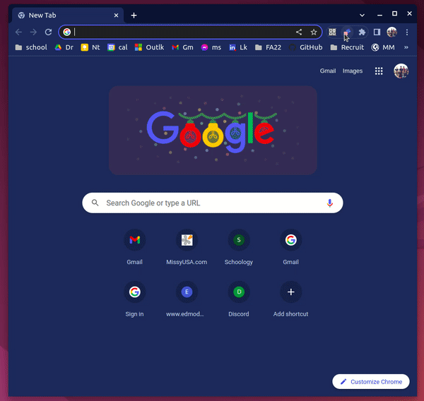

# chrome-gizmos

### List of my low-effort Chrome Extensions

### 1.  **Zetaboard** &ensp;&ensp; [GitHub](https://github.com/yekime/chrome-zetaboard) / [Web Store](https://chrome.google.com/webstore/detail/zetaboard/hliibeddhcdgiobohmphjofiaikledff?hl=en)

Stores and displays [zetamac](https://arithmetic.zetamac.com/) scores and statistics.

### 2.  **Bookmark Randomizer** &ensp;&ensp; [GitHub](https://github.com/yekime/chrome-bookmark-randomizer) / [Web Store](https://chrome.google.com/webstore/detail/bookmark-randomizer/foebageigohbbhjajjofdpfgdnmipncf/related?hl=en)

Opens a random page from a Chrome bookmark folder.

  

